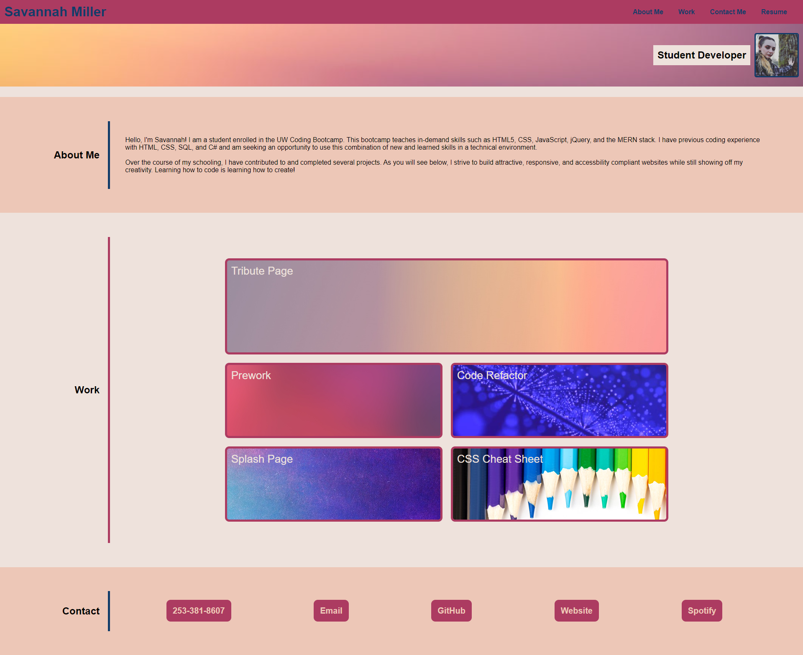
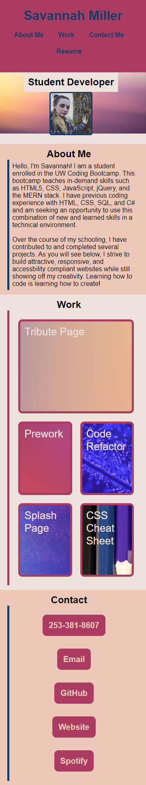

# Professional Portfolio

## Description

This professional portfolio showcases the skills I have learned the past week in the UW Coding Bootcamp. Using HTML, CSS, and advanced CSS techniques such as media queries and pseudo-elements, I have constructed a website from scratch containing my professional portfolio with completed projects. As I further my knowledge through bootcamp, I will add to this portfolio to use when interacting with potential employers.

Fullscreen Webpage

Small Screen Webpage
## Installation

No installation necessary! Please view my deployed page here: https://visualviolet.github.io/professional-portfolio/

## Usage

This portfolio site will be used to highlight my most exemplary work to potential future employers. Students and developers may be interested in looking through the code to see how a responsive website layout can be made with CSS FLexbox and other advanced CSS techniques. To see how this website looks on different devices, please use the Chrome DevTools device toolbar to see how the layout changes when viewed on different sized screens.

## Credits

N/A

## License

MIT License
Copyright (c) 2022 VisualViolet